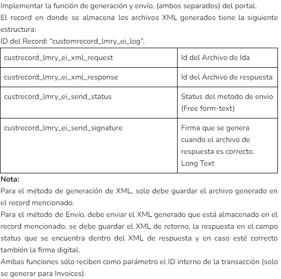

# EXAMEN LATAM

## CONCEPTOS GENERALES (8/17)

### 1) ¿Que se entiende por subsidiaria?

Se entiende por subsidiaria a una empresa que es controlada por una organización central, la cual es la matriz. Estas subsidiarias nacen con el objetivo de expandir los negocios de la organización matriz, estas pueden trabajar en diferentes países o en el mismo país.

### 2) ¿Cuál es la finalidad de usar los campos de clasificación (Department, Class y Location)?

- **Department:** Tienen como finalidad clasificar y realizar un seguimiento de los gastos de la empresa, por ejemplo: gastos de ventas, gastos de administración, gastos de producción, etc. Esto registros pueden ser de ingresos, gastos por departamento, etc. También se pueden realizar en cualquier periodo de tiempo, ya sea mensual, trimestral, semestral, anual, etc.

- **Class:** Tiene como finalidad subdividir los departamentos en si, permitiendo así la creación de categorías, de tal forma que se puedan realizar seguimiento de cierta información como transacciones de ventas, nuevos clientes, etc. Todo esto es útil para seguir de la mejor manera donde se generan los ingresos y gastos.

- **Location:** Tiene como finalidad clasificar mediante determinada ubicación, por ejemplo: manejar gastos en distintos almacenes en diversas locaciones, además se pueden asociar empleados a una determinada locación. Esto permite tener un seguimiento mas preciso de los gastos y de los ingresos. Permitiendo principalmente generación de informes y reportes de manera mas precisa.

### 3) ¿Cómo activar los Ids internos de los campos?

1. Cursor sobre **Home** => _Icono de casita_
2. Clic en **Set Preferences**
3. Clic en el SubTab de **General**
4. Revisar el apartado de **Defaults**
5. Activar la opción de **SHOW INTERNAL IDS**

### 4) En donde se configura el formato de fechas, zona horaria e idioma

1. Cursor sobre **Home** => _Icono de casita_
2. Clic en **Set Preferences**
3. Clic en el SubTab de **General**
4. Revisar el apartado de **Formatting**
5. Configurar formato de fechas en la opción de **DATE FORMAT**
6. Revisar el apartado de **Localization**
7. Configurar zona horaria en la opción de **TIME ZONE**
8. Configurar idioma en la opción de **LANGUAGE**

### 5) En donde se puede configurar las cuentas de Costos (Cogs Account)

Las cuentas de costo de bienes vendidos (COGS) se utilizan solo en **Inventory Items** y en **Assembly Items**. Para configurar una cuenta COGS por defencto, se debe seguir los siguientes pasos:

// TODO: Pendiente pasos

### 6) ¿Qué significa que una cuenta se encuentre configurada en Item Accounting Mapping y Global Accounting Mapping, respectivamente?¿Por qué crees que se realiza este tipo de configuración? Indicar cada caso

---

### 7) Que es un rol y cuál es su finalidad

Los roles son una configuración adicional de acceso a los usuarios, los cuales permiten que los usuarios puedan tener acceso a ciertas funcionalidades de NetSuite, estos roles incluyen un grupo de permisos que pueden contemplar desde el ver y poder editar datos hasta limitar las páginas que pueden ver los usuarios, así como tareas que pueden o no completar.

### 8) ¿Es posible crear un rol en donde solo se muestre una sola pestaña? De ser afirmativa la respuesta, explique cómo se realiza dicho proceso

Si es posible, ya que como se menciono antes se puede limitar el acceso de las páginas que el usuario puede ver.

1. Cursor sobre **Setup**
2. Cursor sobre **Users/Roles**
3. Cursor sobre **Manage Roles**
4. Clic en **New**
5. Completar campos obligatorios como:
   - **NAME:** Nombre del rol
6. Una vez haya limitado todos los permisos, clic en **Save**
7. Cursor sobre **Customization**
8. Cursor sobre **Centers and Tabs**
9. Clic en **Center Tabs**
10. Clic sobre cualquier **Center Tab** actualmente configurado
11. Clic en el SubTab de **Audience**
12. Finalmente si tiene marcada la opción de **All Roles** desmarcarla y seleccionar cualquier rol menos el que se acaba de crear para así poder ocultar la pestaña

### 9) ¿Cuáles son las diferencias entre un ítem de servicio y un ítem de inventario?

El **Service Item** es un producto que no se vende, sino que se presta un servicio, estos no son cuantificables, y pueden ser por ejemplo: un servicio de reparación de computadoras, un servicio de reparación de electrodomésticos, etc. A diferencia de los **Inventory Items**, estos si son cuantificables, y se venden y compran, por ejemplo: un producto de limpieza, un producto de aseo, etc.

### 10) Qué tipo de ítem se usará para representar una promoción (Tablet, Teclado y Mouse). Explique por qué

---

### 11) Qué tipos de ítems nos permite utilizar montos negativos

---

### 12) Realizar un diagrama del flujo de venta

---

### 13) Realizar un diagrama del flujo de compras

---

### 14) Se quiere actualizar el stock de un ítem. Cómo podría realizar ese proceso

1. Asegurarnos de que el **Item** existe y que se encuentra activo
2. Cursor sobre **Transactions**
3. Cursor sobre **Inventory**
4. Clic en **Adjust Inventory**
5. Completar campos obligatorios como:
   - **ADJUSTMENT ACCOUNT:** Cuenta que se usara para registrar el ajuste o actualización del stock
   - **SUBSIDIARY:** Subsidiaria a la cual pertenece el item que se actualizara a nivel de stock
   - **DATE:** Fecha en la cual se realizara el ajuste o actualización del stock
6. En el SubTab de **ADJUSTMENTS** seleccionar el **ITEM** que se desea actualizar
7. Completar campos obligatorios como:
   - **LOCATION:** Ubicación del item que se desea actualizar
   - **ADJUST QTY. BY:** Cantidad que se desea actualizar
8. Clic en **Add** y luego en **Save**

### 15) Se quiere realizar un ajuste de cuentas entre dos subsidiarias, cuál es la transacción que nos permite realizar este procedimiento

---

### 16) Que transacciones implica una devolución de un producto

---

### 17) He creado un nuevo campo, el cual debe estar visible solo para el país México. Indicar cuál es el paso a paso para configurar dicho campo en el proceso Hide&View

1. Asegurarnos de que el **Campo** existe y que se encuentra activo
2. En el buscador de NetSuite escribir **P: LatamReady - Setup Fields View**
3. Clic en la primera opción y luego en dar clic en **New LatamReady - Setup Fields View**
4. Completar campos obligatorios como:
   - **NAME:** Identificador del campo que se desea configurar
   - **COUNTRY:** País al cual se le aplicara la configuración
   - **SECTION:** Sección a la cual pertenece el campo(este se configuro en la creación del campo) por ejemplo: **Cust Col**, **Cust Body**, etc.
5. Adicionalmente se debe especificar en que tipo de transacciones se desea que el campo sea visible, estas opciones están disponibles en el apartado de **Purchase Information**, **Sales Information**, **Other Information**
6. También se puede especificar una entidad, estas opciones están disponibles en el apartado de **Sub Lists (Only Custom Record)**
7. Una vez se haya realizado la configuración, se debe dar clic en **Save**
8. Para que la configuración sea efectiva, se debe dar ejecutar el **Script** de **LatamReady - HideViewData SCHDL V2.0**
9. Para ejecutar el **Schedule Script** basta con darle a editar y luego dar clic en **Save and Execute**
10. Finalmente cuando el progreso de ejecución del **Schedule Script** sea 100%, podrá observar que el campo en cuestión ya es visible y solo para el país México

## SCRIPTS (5.5/11)

### 1) ¿Cuál es la diferencia entre define y require para la declaración de módulos? ¿Qué debo tener en consideración al momento de declarar una librería personalizada en ambos casos?

La diferencia principal que tienen es la manera en que cargan los módulos cada uno. Utilizar la función **require** para importar módulos nativos ayuda a aumentar el rendimiento del script. Esto se logra ya que los módulos son cargados bajo demanda, es decir cuando son utilizados por primera vez. Por otro lado, la función define carga todos los módulos definidos de manera **lazy**, es decir los módulos son cargados de manera automática cuando el script es ejecutado. Para usar uno u otro es necesario tener en cuenta el tipo de modulo que se va a utilizar. Si se va a utilizar un modulo nativo, se debe utilizar la función **require**, de lo contrario, si se va a utilizar un modulo personalizado, se debe utilizar la función define.

### 2) ¿En qué se diferencia un Script y un Script Deployment?

El **Script Record** es básicamente la definición de una secuencia de código utilizado para algún tipo de desarrollo, mientras que el **Script Deployment** contempla no solo la referencia a un **Script Record** sino que se establece como debe ejecutarse, que usuarios pueden ejecutarlo, se pueden también configurar el nivel de logs, el rol necesario, el nivel de prioridad de ejecución, etc.

### 3) El deployado de un script, que se aplica a una transacción, está configurado para la subsidiaria Honeycomb Inc. (Subsidiaria padre). Un usuario que pertenece a la subsidiaria Honeycomb BR (Subsidiaria hija), desea que se ejecute la lógica del script al momento de utilizar una transacción ¿Consideras que el usuario presentará algún problema al visualizar los resultados de la lógica del script?. Indicar el por qué

---

### 4) ¿Cuál es la finalidad de que un script esté configurado en modo 'Testing'?

El modo **Testing** permite que el script se ejecute en modo de prueba, esto para probar la compatibilidad y que no genere errores no esperados, también podemos depurar el script para encontrar e investigar posibles errores, esto para evitar o corregir errores en ambientes de producción.

### 5) Describe la finalidad de los siguientes scripts Client, User Event, Custom GL PLugin

- **Client Script:** Tiene como finalidad validar datos que se ingresan a nivel de usuario, tambien se puede usar este tipo de script para completar campos o sublistas, cambiar valores en base a otros, envio de aleartas. Usualmente se utilizan y van de la mano con un **Suitelet**.

- **User Event Script:** Tiene como finalidad realizar validaciones personalizadas de registros, asegurar la integridad de los datos definidos por el usuario, comprobar permisos y restricciones de registros, ademas de realizar sincronización de datos en tiempo real. Estos se ejecutan del lado del servidor y usualmente se utilizan y van de la mano con **Suitelet, Scheduled Script y Portlet**.

- **Custom GL Plugin:** ----------

### 6) Si estás utilizando un Suitelet para consumo de web services ¿Qué campos del deployado del script debes configurar y por qué?

---

### 7) Quieres utilizar el módulo N/file desde un script Cliente, para guardar un archivo, pero dicho módulo no se encuentra disponible para ese tipo de script. ¿Cuál sería la solución que tendrías para poder realizar dicho proceso desde el mismo Client Script?

---

### 8) Un script de servidor (Suitelet) tiene como procedimiento final ejecutar un map/reduce, sin embargo al enviarlo seguido nos borra el siguiente error 'MAP_REDUCE_ALREADY_RUNNING', el procedimiento que se ejecuta en el map/reduce es de crear pagos de facturas de venta y enviar un correo al cliente, en la interfaz se selecciona qué facturas se van a pagar. Qué solución propone para solucionar este caso sabiendo que toda información enviada desde el suitelet debe ser ejecutada en el map/reduce

---

### 9) Implementar código el cual permita crear un proveedor, cabe recalcar que la subsidiaria sólo se debe llenar siempre y cuando esté activo el feature Subsidiaries de los 'Enabled Features' de NetSuite'

```javascript
/* 
Implementar código el cual permita crear un proveedor, cabe recalcar que la subsidiaria 
sólo se debe llenar siempre y cuando esté activo el feature Subsidiaries de los 
'Enabled Features' de NetSuite'
*/

define(["N/record", "N/log", "N/runtime"], function (record, log, runtime) {
  var LMRY_SCRIPT_NAME = "LMRY - Exercise 1";

  /**
   * @type {{SUBSIDIARY:boolean}}
   */
  var FEATURES = { SUBSIDIARY: false };

  /** - Crea un proveedor con respecto a una subsidiaria
   * @description Crea un proveedor con respecto a una subsidiaria
   * @param {string} subsidiaryId - Subsidiaria a la cual se le creará el proveedor
   * @returns {number} - Retorna el id del proveedor creado
   */
  function _createVendor(subsidiaryId) {
    try {
      // subsidiaryId = 7 = Argentina => For LatamReady - QA MultiBook (old)
      if (!subsidiaryId) {
        throw new Error("No se ha especificado una subsidiaria");
      }
      // Set Features
      _setFeatures();

      var objRecord = record.create({
        type: record.Type.VENDOR,
        isDynamic: true,
      });

      var randomAux = Math.floor(Math.random() * 1000);

      objRecord.setValue({
        fieldId: "entityid",
        value: "LMRY - Vendor" + randomAux,
      });

      objRecord.setValue({
        fieldId: "companyname",
        value: "LMRY - Vendor" + randomAux,
      });

      if (FEATURES.SUBSIDIARY) {
        objRecord.setValue({
          fieldId: "subsidiary",
          value: subsidiaryId,
        });
      }

      var vendorId = objRecord.save({
        enableSourcing: true,
        ignoreMandatoryFields: true,
      });
    } catch (error) {
      log.error("Error in _createVendor", {
        title: "[ MPRD - _createVendor ]",
        message: error,
        relatedScript: LMRY_SCRIPT_NAME,
      });
    }
  }

  /** - Setea el valor de las features
   * @description Setea el valor de las features
   * @returns {void} No retorna nada pero guarda datos en la variable global FEATURES
   */
  function _setFeatures() {
    try {
      var containFeature = false;

      containFeature = runtime.isFeatureInEffect({
        feature: "SUBSIDIARIES",
      });
      if (containFeature == true || containFeature == "T") {
        FEATURES.SUBSIDIARY = true;
      }
    } catch (error) {
      log.error("Error in _setFeatures", {
        title: "[ MPRD - _setFeatures ]",
        message: error,
        relatedScript: LMRY_SCRIPT_NAME,
      });
    }
  }
});
```

### 10) Implemente una función en el cual ingrese como parámetro el id de una Oportunidad, ahora a partir de esta transacción se deben crear los siguientes récords: Quote (Estimate), Sales Order, Invoice, Customer Payment. La función debe retornar un objeto con todos los ids de las transacciones creadas. (No olvide que una transacción depende de la anterior, por ejemplo el Sales order se crea a partir del Quote, el invoice a partir del sales order y así sucesivamente)

---

### 11) Realizar una búsqueda de las transacciones creadas en los últimos 5 días (las transacciones a considerar son: Invoice, Vendor Bill, Credit memo, Vendor Credit). Las transacciones deben estar agrupadas por subsidiaria

```javascript
/* 
Realizar una búsqueda de las transacciones creadas en los últimos 5 días 
(las transacciones a considerar son: Invoice, Vendor Bill, Credit memo, Vendor Credit). 
Las transacciones deben estar agrupadas por subsidiaria.
*/
define(["N/search", "N/format", "N/log"], function (search, format, log) {
  var LMRY_SCRIPT_NAME = "LMRY - Exercise 2";

  /**
   * @type {{date:string,day:string,month:string,year:string,time:number}}
   */
  var endDate = {};
  /**
   * @type {{date:string,day:string,month:string,year:string,time:number}}
   */
  var startDate = {};
  /**
   * @type {number}
   */
  var MILI_SECONDS_DAY = 24 * 60 * 60 * 1000;

  var rta = {};

  /** - Obtiene las transacciones en los ultimos 5 dias, agrupadas por subsidiaria
   * @description Obtiene las transacciones en los ultimos 5 dias, agrupadas por subsidiaria
   * @returns {void} - No retorna nada pero guarda datos en la variable rta
   */
  function _getLastFiveTran() {
    try {
      var DbolStop = false;
      var minInterval = 0;
      var maxInterval = 1000;

      var LT_Filters = [
        search.createFilter({
          name: "type",
          operator: search.Operator.ANYOF,
          values: ["CustInvc", "VendBill", "CustCred", "VendCred"],
        }),
      ];

      var LT_Columns = [
        search.createColumn({
          name: "subsidiary",
          summary: search.Summary.GROUP,
          label: "0. LatamReady - Subsidiary",
        }),
        search.createColumn({
          name: "internalid",
          summary: search.Summary.GROUP,
          label: "1. LatamReady - Internal ID",
        }),
        search.createColumn({
          name: "trandate",
          summary: search.Summary.GROUP,
          label: "2. LatamReady - Transaction Date",
        }),
        search.createColumn({
          name: "formulatext",
          summary: search.Summary.GROUP,
          formula: "{type.id}",
          label: "3. LatamReady - Tipo de Transacción",
        }),
      ];

      var currentDate = new Date();
      endDate = _sortFormatDates(currentDate);
      startDate = _sortFormatDates(
        new Date(currentDate.getTime() - 5 * MILI_SECONDS_DAY)
      );

      LT_Filters.push(
        search.createFilter({
          name: "trandate",
          operator: search.Operator.ONORAFTER,
          values: [startDate.date],
        }),
        search.createFilter({
          name: "trandate",
          operator: search.Operator.ONORBEFORE,
          values: [endDate.date],
        })
      );

      var LT_Search = search.create({
        type: search.Type.TRANSACTION,
        filters: LT_Filters,
        columns: LT_Columns,
      });

      var searchResult = LT_Search.run();

      var auxResult;
      while (!DbolStop) {
        auxResult = searchResult.getRange(minInterval, maxInterval);
        if (auxResult != null) {
          if (auxResult.length != 1000) DbolStop = true;
          for (var i = 0; i < auxResult.length; i++) {
            var columns = auxResult[i].columns;

            var subId = auxResult[i].getValue(columns[0]);
            var tranId = auxResult[i].getValue(columns[1]);
            var tranDate = auxResult[i].getValue(columns[2]);
            var tranType = auxResult[i].getValue(columns[3]);

            if (rta[subId] == null) rta[subId] = [];
            rta[subId].push({
              tranId: tranId,
              tranDate: tranDate,
              tranType: tranType,
            });
          }
          minInterval = maxInterval;
          maxInterval = maxInterval + 1000;
        } else {
          DbolStop = true;
        }
      }
    } catch (error) {
      log.error("Error in _getLastFiveTran", {
        title: "[ MPRD - _getLastFiveTran ]",
        message: error,
        relatedScript: LMRY_SCRIPT_NAME,
      });
    }
  }

  /** - Convertir formato de fecha a uno soportado por NetSuite, y devuelve información de fecha
   * @description - Convertir formato de fecha a uno soportado por NetSuite, y devuelve información de fecha
   * @param {string|undefined|null|"- None -"} date - Fecha con formato X
   * @returns {{date:string,day:string,month:string,year:string,time:number}} - Objeto con fecha en formato dd/mm/yyyy, mes, año y tiempo en milisegundos
   */
  function _sortFormatDates(date) {
    try {
      if (!date || date == "- None -") {
        throw new Error("No se ha ingresado una fecha válida");
      }

      var dateParsed = format.parse({
        value: date,
        type: format.Type.DATE,
      });

      var time = dateParsed.getTime();

      var dayReport = dateParsed.getDate();
      if (("" + dayReport).length == 1) {
        dayReport = "0" + dayReport;
      } else {
        dayReport = dayReport + "";
      }

      var monthReport = dateParsed.getMonth() + 1;
      if (("" + monthReport).length == 1) {
        monthReport = "0" + monthReport;
      } else {
        monthReport = monthReport + "";
      }

      var yearReport = dateParsed.getFullYear();
      date = dayReport + "/" + monthReport + "/" + yearReport;

      return {
        date: date,
        day: dayReport,
        month: monthReport,
        year: yearReport,
        time: time,
      };
    } catch (error) {
      log.error("Error in _sortFormatDates", {
        title: "[ SCHDL - _sortFormatDates ]",
        message: error,
        relatedScript: LMRY_SCRIPT_NAME,
      });
    }
  }
});
```

## REPORTES (7/7)

### 1) Cuales son los Récords que usa todo Report Generator de cualquier reporte de cualquier país; y cuál es el uso de cada uno de ellos?

#### Records From Integration SuiteTax - Legacy

- **LatamReady - Legal Ledger:** Este recordar contiene la información del nombre del reporte, a que pais pertenece, adicionalmente contiene el id del script y el deployment que se va a ejecutar para generar el reporte, este script es de tipo MPRD o SCHDL.
- **LatamReady - Legal Template:** Este record se utiliza para definir el formato de los reportes, características como el tipo de extensión del reporte, el tipo codificación, el tipo de formato, el uso o no de un template, etc. Este esta relacionado al **LatamReady - Legal Ledger**.
- **LatamReady - SuiteTax Rpt Filter:** Este record se utiliza para definir los campos que se mostraran en el Suitelet y que son necesarios para generar el reporte, este record contiene campos como el tipo de campo, el nombre del campo, el label del campo, el tipo de filtro, etc. Además esta relacionado al **LatamReady - Legal Ledger**.

#### Common Records

- **Accounting Period:** Este record contiene la información de los periodos contables, contiene información como el nombre del periodo, la fecha de inicio y fin del periodo, el estado del periodo, etc.
- **Subsidiary:** Este record contiene la información de las subsidiarias, contiene información como el nombre de la subsidiaria, el pais, el estado, etc.
- **Multi-Book:** Este record contiene la información de los libros contables, contiene información como el nombre del libro, el estado, etc.

### 2) De la anterior pregunta, implementar el proceso Accounting Context (Redireccionamiento de Cuentas) de reportes

Para considerar el proceso de 'Redireccionamiento de Cuentas' dentro de un reporte se deben considerar algunos aspectos, el primero es el que si afecta a las cuentas de tipo **Bank, Accounts Receivable, Accounts Payable y Credit Card** donde se debe especificar el libro contable, numero y nombre de la cuenta; el segundo es que puede afectar a todo tipo de cuentas, pero solo para cambiar el numero y nombre de la cuenta en base al Set Preferences. Para ambas se deben tener configurado el SubTab de **Localization** dentro de la cuenta.

### 3) Qué tipos de reportes usan los asientos por 'Period End Journal'. Cual es la diferencia con los asientos con periodos de ajuste que se configuran en el 'Manage Account Periods'

Para considerar **'Period End Journal'** dentro de un reporte se deben considerar algunos Features como los son el **PERIODENDJOURNALENTRIES**, el cual es un Feature que se utiliza para que los reportes consideren transacciones de tipo **Period End Journal**. Adicionalmente a esto se debe considerar que las transacciones deben pertenecer a un **Period Adjust**. Por otro lado, el **Manage Account Periods** es un proceso que se utiliza para configurar los periodos contables relacionados a un calendario fiscal y agruparlos dentro de un año fiscal, además dentro de estos se pueden adicionar los periodos de ajuste.

### 4) Para el proceso 'Special Period' dentro de los reportes legales, cual es la lógica a tomar tanto para los reportes mensuales como anuales y los feature a considerar para validar la realización de dicho proceso

Para considerar el proceso de **'Special Period'** dentro de un reporte se deben considerar algunos Features como los son el **SPECIAL ACCOUNTING PERIOD**, el cual es un Feature que se utiliza para indicar que el periodo de cierre es diferente al periodo de reporte, también el Feature **MULTIPLECALENDARS** este pasa como un filtro adicional, en caso este activo se buscara que coincida con el respectivo calendario, adicionalmente se debe configurar el record **LatamReady - Special Accounting Period**, donde se especifican el periodo, inicio y fin del periodo, año y calendario fiscal.

### 5) Implementar una búsqueda por script del Catálogo de Cuenta de cualquier país. Columnas a considerar : Nro (Correlativo), Número de Cuenta, Nombre

```javascript
/* 
Implementar una búsqueda por script del Catálogo de Cuenta de cualquier país. 
Columnas a considerar : Nro (Correlativo), Número de Cuenta, Nombre
*/

define(["N/search", "N/log"], function (search, log) {
  var LMRY_SCRIPT_NAME = "LMRY - Exercise 4";

  /**
   * @type {Array<string>}
   */
  var subsidiariesGroup = [];

  /**
   * @type {Array<{correlative:string,accountId:string,accountNumber:string|'- None -',accountName:string}>}
   */
  var accountsData = [];

  /** - Obtiene todas las subsidiarias de un país
   * @description Obtiene todas las subsidiarias de un país
   * @param {string} countryCode - Código del país
   * @returns {void} - No retorna nada pero guarda los datos en la variable subsidiariesGroup
   */
  function _getSubsidiariesByCountry(countryCode) {
    try {
      // countryCode = AR = Argentina => For LatamReady - QA MultiBook (old)
      if (!countryCode) {
        throw new Error("No se ha especificado el código del país");
      }

      var DbolStop = false;
      var minInterval = 0;
      var maxInterval = 1000;

      var SC_Filters = [
        search.createFilter({
          name: "country",
          operator: search.Operator.ANYOF,
          values: [countryCode],
        }),
      ];

      var SC_Columns = [
        search.createColumn({
          name: "internalid",
          summary: search.Summary.GROUP,
          label: "0. LatamReady - Internal ID",
        }),
      ];

      var SC_Search = search.create({
        type: search.Type.SUBSIDIARY,
        filters: SC_Filters,
        columns: SC_Columns,
      });

      var searchResult = SC_Search.run();

      var auxResult;
      while (!DbolStop) {
        auxResult = searchResult.getRange(minInterval, maxInterval);
        if (auxResult != null) {
          if (auxResult.length != 1000) DbolStop = true;
          for (var i = 0; i < auxResult.length; i++) {
            var columns = auxResult[i].columns;

            var subsidiaryId = auxResult[i].getValue(columns[0]);

            subsidiariesGroup.push(subsidiaryId);
          }
          minInterval = maxInterval;
          maxInterval = maxInterval + 1000;
        } else {
          DbolStop = true;
        }
      }
    } catch (error) {
      log.error("Error in _getSubsidiariesByCountry", {
        title: "[ MPRD - _getSubsidiariesByCountry ]",
        message: error,
        relatedScript: LMRY_SCRIPT_NAME,
      });
    }
  }

  /** - Obtiene todas las cuentas de subisidiarias de un determinado pais
   * @description Obtiene todas las cuentas de subisidiarias de un determinado pais
   * @param {string} countryCode - Código del país
   * @returns {void} - No retorna nada pero guarda datos en la variable accountsData
   */
  function _getAccountsByCountry(countryCode) {
    try {
      var DbolStop = false;
      var minInterval = 0;
      var maxInterval = 1000;

      _getSubsidiariesByCountry(countryCode);
      if (subsidiariesGroup.length == 0) accountsData = [];

      var AC_Filters = [
        search.createFilter({
          name: "subsidiary",
          operator: search.Operator.ANYOF,
          values: subsidiariesGroup,
        }),
      ];

      var AC_Columns = [
        search.createColumn({
          name: "internalid",
          summary: search.Summary.GROUP,
          label: "0. LatamReady - Internal ID",
        }),
        search.createColumn({
          name: "number",
          summary: search.Summary.GROUP,
          label: "1. LatamReady - Account Number",
        }),
        search.createColumn({
          name: "displayname",
          summary: search.Summary.GROUP,
          label: "2. LatamReady - Account Name",
        }),
      ];

      var IT_Search = search.create({
        type: search.Type.ACCOUNT,
        filters: AC_Filters,
        columns: AC_Columns,
      });

      var searchResult = IT_Search.run();

      var auxResult;
      var countCorrelative = 1;
      while (!DbolStop) {
        auxResult = searchResult.getRange(minInterval, maxInterval);
        if (auxResult != null) {
          if (auxResult.length != 1000) DbolStop = true;
          for (var i = 0; i < auxResult.length; i++) {
            var columns = auxResult[i].columns;

            var accountId = auxResult[i].getValue(columns[0]);
            var accountNumber = auxResult[i].getValue(columns[1]);
            var accountName = auxResult[i].getValue(columns[2]);

            accountsData.push({
              correlative: _completeCorrelative(6, countCorrelative),
              accountId: accountId,
              accountNumber: accountNumber,
              accountName: accountName,
            });

            countCorrelative++;
          }
          minInterval = maxInterval;
          maxInterval = maxInterval + 1000;
        } else {
          DbolStop = true;
        }
      }
    } catch (error) {
      log.error("Error in _getAccountsByCountry", {
        title: "[ MPRD - _getAccountsByCountry ]",
        message: error,
        relatedScript: LMRY_SCRIPT_NAME,
      });
    }
  }

  /** - Agrega ceros a la izquierda según el tamaño del string y el tamaño deseado
   * @description - Agrega ceros a la izquierda según el tamaño del string y el tamaño deseado
   * @param {number} size - Tamaño del string
   * @param {string} value - String a formatear
   * @returns {string} - String formateado con ceros a la izquierda
   */
  function _completeCorrelative(size, value) {
    try {
      var valueLength = ("" + value).length;
      if (("" + value).length <= size) {
        if (size != ("" + value).length) {
          for (var i = ("" + value).length; i < size; i++) {
            value = "0" + value;
          }
        } else {
          return value;
        }
        return value;
      } else {
        value = value.substring(valueLength - size, valueLength);
        return value;
      }
      return value;
    } catch (error) {
      log.error("Error in _completeCorrelative", {
        title: "[ SCHDL - _completeCorrelative ]",
        message: error,
        relatedScript: LMRY_SCRIPT_NAME,
      });
    }
  }
});
```

## FACTURACIÓN ELECTRÓNICA (0/3)

### 1) A nivel conceptual, listar las diferencias entre el flujo Own y el flujo Estándar

---

### 2) Diferencias de los campos que tenga un ambiente Legacy y SuiteTax(Subsidiarias y Transacciones)

---

### 3) Resolver la siguiente pregunta



Link del servicio: <https://docs.google.com/presentation/d/1e-tXkuudljOOHjJ8n2zlJKscKRnc-kjOZG-CFd6hJ8E/edit#slide=id.g560ae87161_0_0>

---
